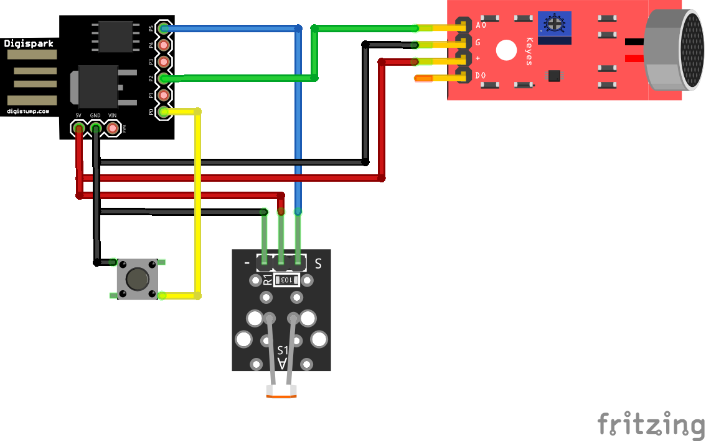

# KEYNY
A ridiculously cheap and simple hardware random key generator, based on a Digispark ATtiny85.

## DISCLAIMER
This is a home project, it's not for high-assurance or certified use. Use it at your own risk.

## What is it?
Keyny is a random key generator. It captures the least significant bits of analog readings from two physically independent sources (a KY-038 microphone and a KY-018 photoresistor), plus human-generated entropy from button press timing.
All readings are accumulated in a circular buffer via XOR and passed to a BLAKE2s hash function to produce a 256-bit key.

## Should you use it?
Maybe not.
But it's totally open, free, simple, funny, with just one dependency, and it works everywhere simulating a USB keyboard.

## Components
- 1x Digispark ATtiny85
- 1x KY-038
- 1x KY-018
- 1x Button

**IMPORTANT:** Adjust the KY-038 potentiometer until the microphone reads ~120 in silent conditions.

## Schematic


## How to use it
- just plug in your Keyny
- wait 8 seconds (5 for bootloader and 3 for sketch delay)
- tap on the sensors with your hand few times
- select the input field on pc and press the Keyny button

## Tests
I tested the entropy of the buffer (before BLAKE2s) tapping on the sensors.
Here the results (only 35 readings for the moment):
```
Entropy = 7.868991 bits per byte.

Optimum compression would reduce the size
of this 2240 byte file by 1 percent.

Chi square distribution for 2240 samples is 447.77, and randomly
would exceed this value less than 0.01 percent of the times.

Arithmetic mean value of data bytes is 123.2000 (127.5 = random).
Monte Carlo value for Pi is 3.152815013 (error 0.36 percent).
Serial correlation coefficient is 0.027708 (totally uncorrelated = 0.0).
```
## TO DO
- 3D printed case
- entropy test with more readings
- test with other modules for better randomness (also without tapping on the sensors)

## Thanks
A special thanks to **Aykevl** for his [blake2s-micro implementation](https://github.com/aykevl/blake2s-micro).